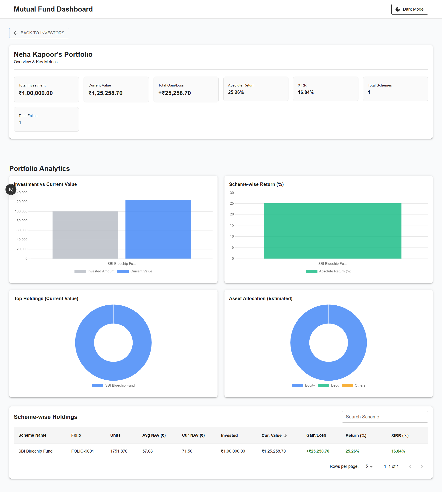
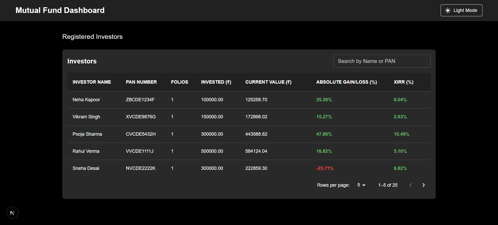

# mutualFundDashboard-frontend

It is a mutual fund dashboard where the investor return is visible. Portfolio summary, analytics and portfolio wise holding is visible.

# 📊 Mutual Fund Portfolio Dashboard - Frontend

A modern Mutual Fund Portfolio Dashboard built with **Next.js**, **React**, **TypeScript**, **Material UI**, and **Redux Toolkit**.

The application enables users to view investor portfolios, analyze mutual fund holdings, monitor portfolio performance, and visualize investment insights through interactive charts and analytics.

---

## ✨ Features

- 📋 Investor Dashboard
- 📈 Portfolio Summary
- 📊 Portfolio Analytics
- 💼 Scheme-wise Holdings
- 📉 Gain/Loss Analysis
- 📊 Interactive Charts (Chart.js)
- 🔍 Investor Selection
- ⚡ REST API Integration
- 🌙 Light & Dark Theme Support
- 📱 Responsive Material UI Design
- 🔄 Redux Toolkit State Management

---

## 🛠 Tech Stack

| Category          | Technology                 |
| ----------------- | -------------------------- |
| Framework         | Next.js 16                 |
| Language          | TypeScript                 |
| UI Library        | React 19                   |
| Component Library | Material UI (MUI)          |
| State Management  | Redux Toolkit              |
| HTTP Client       | Axios                      |
| Charts            | Chart.js + react-chartjs-2 |
| Styling           | CSS + MUI                  |
| Linting           | ESLint                     |

---

# 📁 Project Structure

```
src
├── components
│   ├── common
│   │   └── Header.tsx
│   │
│   ├── InvestorPortfolio
│   │   ├── PortfolioAnalytics.tsx
│   │   ├── PortfolioSchemeWiseHoldings.tsx
│   │   └── PortfolioSummary.tsx
│   │
│   ├── InvestorTableDashboard.tsx
│   └── JsonUploader.tsx
│
├── context
│   └── ThemeContext.tsx
│
├── pages
│   ├── index.tsx
│   ├── portfolio
│   │   └── [id]
│   │       └── index.tsx
│   ├── _app.tsx
│   └── _document.tsx
│
├── services
│   ├── InvestorDashboard
│   └── InvestorPortfolio
│
├── store
│   ├── feature
│   │   ├── InvestorDashboard
│   │   └── InvestorPortfolio
│   └── index.tsx
│
├── styles
├── types
└── utils
```

---

# 🚀 Getting Started

## Prerequisites

- Node.js **24+**
- npm

---

## Clone the Repository

```bash
git clone https://github.com/rajat3095/mutualFundDashboard-frontend.git

cd mutualFundDashboard-frontend
```

---

## Install Dependencies

```bash
npm install
```

---

## Environment Variables

Create a `.env.local` file in the project root.

Example:

```env
NEXT_PUBLIC_API_BASE_URL=http://localhost:5000/api
```

Update the URL according to your backend server.

---

## Start Development Server

```bash
npm run dev
```

Open

```
http://localhost:3000
```

---

## Data

You can see the data folder in the project in which data.json file is present. You can use that file and can upload ot from the UI so that the data is store in the database and you can go through the application.

## Production Build

```bash
npm run build
```

Run production server

```bash
npm start
```

---

# 📦 Available Scripts

| Command       | Description              |
| ------------- | ------------------------ |
| npm run dev   | Start development server |
| npm run build | Create production build  |
| npm start     | Run production server    |
| npm run lint  | Run ESLint               |

---

# 🏗 Architecture

```
Next.js Pages Router
        │
        ▼
React Components
        │
        ▼
Redux Toolkit
        │
        ▼
Axios Services
        │
        ▼
Backend REST API
```

---

# 📊 Application Flow

```
Dashboard
      │
      ▼
Investor List
      │
      ▼
Portfolio Details
      │
      ├── Portfolio Summary
      ├── Portfolio Analytics
      └── Scheme-wise Holdings
```

---

# 📸 Screenshots




---

# 🔌 Backend Repository

The frontend consumes data from the backend REST API.

Backend Repository:

https://github.com/rajat3095/mutualFundDashboard-backend

---

# 📄 License

This project is licensed under the MIT License.

---

# 👨‍💻 Author

**Rajat Gandhi**

- GitHub: https://github.com/rajat3095
- Repository: https://github.com/rajat3095/mutualFundDashboard-frontend

---

# ⭐ Show Your Support

If you found this project helpful, please consider giving it a **⭐ Star** on GitHub.

It helps others discover the project and motivates future improvements.

---
